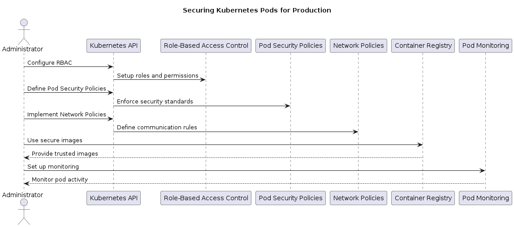
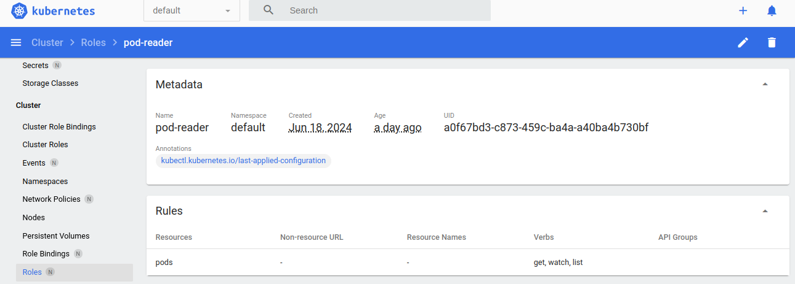
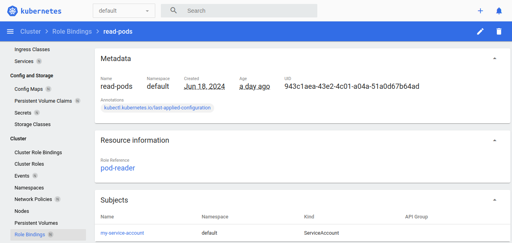
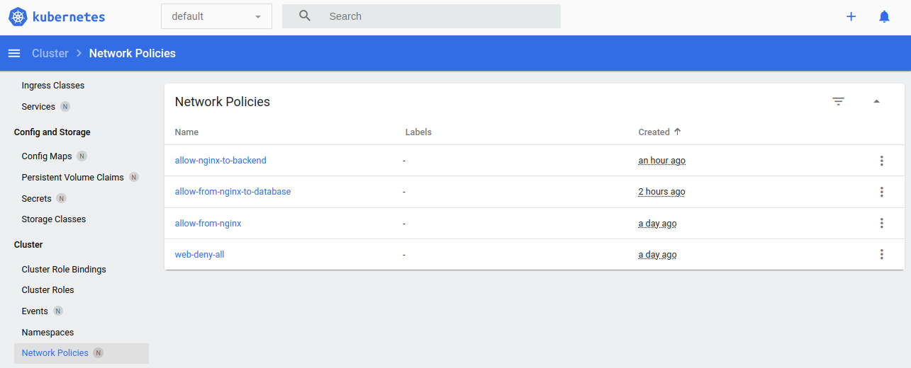
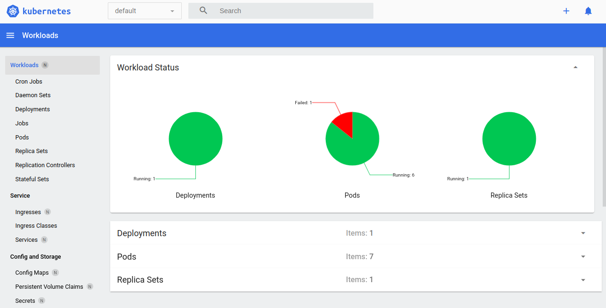

# Securing Kubernetes Pods For Production Workloads



---

``` 
Securing Kubernetes pods for production means taking steps to protect them from unauthorized access and potential threats. Here’s how you can do it:
```
#### 1) Use Role-Based Access Control (RBAC): 

- Set up who can access and modify pods based on their roles in the organization. This prevents unauthorized users from making changes.

#### 2) Limit Pod Privileges: 

- Pods should only have the permissions they absolutely need. Avoid giving them more access than necessary to reduce risks.

#### 3) Network Policies: 

- Define rules for how pods communicate with each other and the outside world. This prevents unauthorized connections and data leaks.

#### 4) Use Secure Images: 

- Only use container images from trusted sources. Regularly update and scan them for vulnerabilities to keep your pods safe.

#### 5) Pod Security Policies: 

- Enforce policies that specify security standards for pods, like requiring encryption or limiting host access.

#### 6) Monitor and Audit: 

- Keep an eye on pod activity and log events for any suspicious behavior. This helps in identifying and responding to security breaches quickly. 


### First For Role-Based Access Control (RBAC)

> Create Service Account

```yml
apiVersion: v1
kind: ServiceAccount
metadata:
  name: my-service-account  
```

- Run Commnad

``` kubectl apply -f service-account.yaml ```


> Create a role

```yml
kind: Role
apiVersion: rbac.authorization.k8s.io/v1
metadata:
  namespace: default
  name: pod-reader
rules:
- apiGroups: [""]
  resources: ["pods"]
  verbs: ["get", "watch", "list"]
```
- Run Command 

```kubectl apply -f role.yaml```




> Bind Role to Service Account

```yml
kind: RoleBinding
apiVersion: rbac.authorization.k8s.io/v1
metadata:
  name: read-pods
  namespace: default
subjects:
- kind: ServiceAccount
  name: my-service-account
  apiGroup: rbac.authorization.k8s.io
roleRef:
  kind: Role
  name: pod-reader
  apiGroup: rbac.authorization.k8s.io
```

- Run Command 

```kubectl apply -f role-binding.yaml```



### Now its time to limit Pod Privileges (Security Context)

> Define Pod with Security Context

```yml
apiVersion: v1
kind: Pod
metadata:
  name: nginx
spec:
  containers:
  - name: nginx
    image: nginx
    securityContext:
      runAsUser: 1000
      runAsGroup: 3000
      capabilities:
        add:
          - NET_ADMIN
```
- Run Command 

``` kubectl apply -f nginx-pod.yaml```

### Now we will define Network Policies

> Create A Network Policy

```yml
apiVersion: networking.k8s.io/v1
kind: NetworkPolicy
metadata:
  name: allow-from-nginx
spec:
  podSelector:
    matchLabels:
      app: nginx
  ingress:
  - from:
    - podSelector:
        matchLabels:
          app: backend
```

- Run Command 

``` kubectl apply -f network-policy.yaml ```



### Use Secure Images

> When deploying pods, ensure to specify a secure image pull policy.

```yml
apiVersion: apps/v1
kind: Deployment
metadata:
  name: nginx-deployment
spec:
  replicas: 3
  selector:
    matchLabels:
      app: nginx
  template:
    metadata:
      labels:
        app: nginx
    spec:
      containers:
      - name: nginx
        image: nginx:latest
        imagePullPolicy: IfNotPresent
```

``` kubectl apply -f nginx-deployment.yml```

### Pod Security Policies (Optional)

- Implementing Pod Security Policies involves additional setup and configuration beyond the sc ope of this basic guide.

### Monitoring and Auditing
+ Ir requires additional configuration and setup.which is beyond the basics and its an advance level of task


### Final Statement 

+ It Specifies practical experience in securing Kubernetes pods using RBAC, security contexts, network policies, and image security measures


## Update in the task

+ In network policy make a change where traffic coming from webserver(Nginx) to database (any database i can you here i use mysql) is only allowed all other traffic should get denied


### Change in network policy

* networkpolicy.yml

```yml
apiVersion: networking.k8s.io/v1
kind: NetworkPolicy
metadata:
  name: allow-nginx-to-backend
spec:
  podSelector:
    matchLabels:
      app: backend  
  ingress:
  - from:
    - podSelector:
        matchLabels:
          app: nginx
```


* i Have define backend-pod.yml file where i define my database image in which i accept traffic of nginx and deny all other traffic


```yml
apiVersion: v1
kind: Pod
metadata:
  name: backend-pod
  labels:
    app: backend
spec:
  containers:
  - name: backend
    image: mysql:5.7
    env:
    - name: MYSQL_ROOT_PASSWORD
      value: mysecretpassword
```

* After that i have created one nginx-pod which can make communication between nginx and database by allowing traffic from nginx to database


```yml
apiVersion: v1
kind: Pod
metadata:
  name: nginx-pod
  labels:
    app: nginx
spec:
  containers:
  - name: nginx
    image: nginx
```
* once the opertion done we will run the following command to test connectivity

+ After deploying the pods and applying the NetworkPolicy:

### Test connectivity to verify if the policy is working as expected.

``` From nginx-pod (allowed): ```

```bash
kubectl exec -it nginx-pod -- sh
```

+ From within the shell of nginx-pod, try to ping or access the backend-pod:

```bash
ping backend-pod
```
+ If the NetworkPolicy is correctly enforced, you should see successful communication with the backend-pod.


+ Now we create on test-pod.yml which is a blocked one pod which means it is restricted for sending traffic in database(backend-pod) 

+ test-pod.yml

```yml
apiVersion: v1
kind: Pod
metadata:
  name: test-pod
spec:
  containers:
  - name: test-container
    image: busybox
    command: ["sleep", "3600"]
```

+ Apply the test pod:

```bash
kubectl apply -f test-pod.yml
```

+ Execute a shell inside the test-pod:

```bash
kubectl exec -it test-pod -- sh
```

+ From within the shell of test-pod, try to ping or access the backend-pod:

```bash
ping backend-pod
```

+ If the NetworkPolicy is correctly enforced, you should see that communication with the backend-pod from test-pod is blocked.




